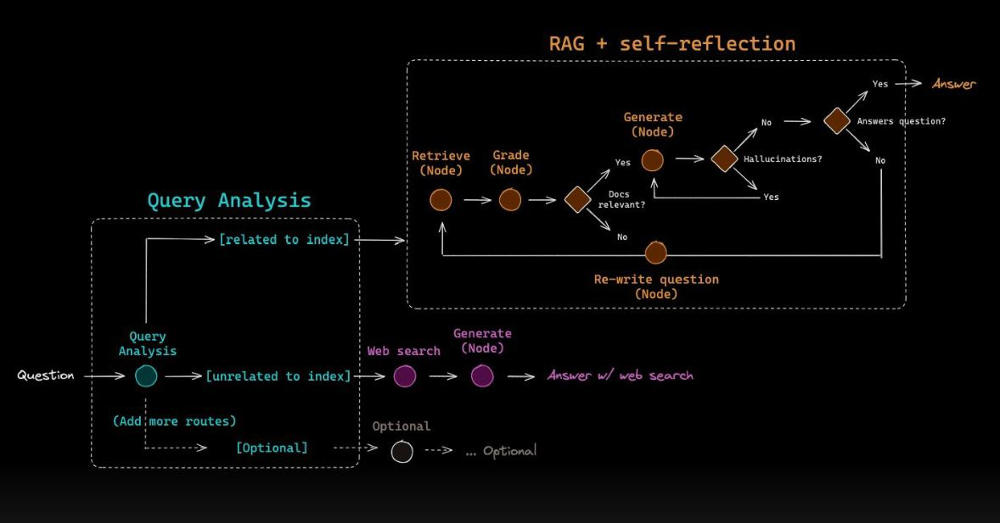

# 🧠 Failure-Aware CRAG with Explicit Hallucination Detection and Evidence Coverage Scoring

<p align="center">
  
  <br>
  <em>System architecture of the Failure-Aware CRAG pipeline.</em>
</p>

> **Failure-Aware CRAG** is a hallucination-resistant retrieval-augmented QA system that explicitly detects insufficient evidence, verifies answer grounding via evidence coverage scoring, and adapts retrieval or falls back to the web when document support fails.

---

## 📌 Motivation

Retrieval-Augmented Generation (RAG) systems are widely used to ground large language models in external documents. However, most RAG pipelines implicitly assume retrieval success and lack explicit mechanisms to detect when grounding is insufficient, leading to silent hallucinations.

Common failure modes include:
- Retrieval of weakly relevant or incomplete context  
- Queries that fall outside the document scope  
- Overconfident model outputs unsupported by evidence  

This project addresses these limitations by introducing a **Failure-Aware CRAG architecture** that explicitly reasons about retrieval adequacy, generation reliability, and evidence alignment before producing an answer.

---

## 🧩 Core Contributions

This system extends standard RAG pipelines with:

- Explicit hallucination detection based on retrieval similarity and generation signals  
- Failure classification to distinguish weak context, out-of-scope queries, and valid answers  
- Adaptive evidence retrieval that expands context when grounding is weak  
- Evidence Coverage Scoring for post-generation grounding verification  
- Confidence-based refusal when evidence is insufficient  
- Transparent web fallback with explicit labeling  
- Fully local LLM inference without paid or opaque APIs  

---

## 🏗️ System Overview

The architecture diagram above illustrates the end-to-end pipeline:

1. Documents are uploaded and chunked at ingestion time  
2. Chunks are embedded and indexed using FAISS  
3. At query time, relevant evidence is retrieved  
4. Retrieval adequacy is evaluated before generation  
5. Answers are verified using evidence coverage scoring  
6. Failure cases trigger adaptive retry or web fallback  

---

## 🧠 Failure-Aware CRAG Logic

Unlike traditional RAG systems, this pipeline does not blindly trust retrieval results.

At query time, the system computes:
- Maximum similarity score between the query and retrieved chunks  
- Average similarity score across retrieved evidence  
- Model output signals such as uncertainty or evasive responses  

Each query is classified into one of the following states:

- `OK` – sufficient evidence and confident generation  
- `WEAK_CONTEXT` – partial grounding; adaptive retry triggered  
- `OUT_OF_SCOPE` – unsupported by documents; fallback required  

---

## 🔁 Adaptive Evidence Retrieval

When weak grounding is detected:
- Retrieval depth is expanded (`Top-K → Top-6`)  
- Context is reconstructed from a broader evidence pool  
- Generation is retried once to avoid infinite loops  

This allows the system to recover from borderline retrieval failures without hallucinating.

---

## 🧠 Evidence Coverage Scoring

In addition to retrieval-time checks, the system performs post-generation verification using Evidence Coverage Scoring.

### Definition


### Usage

Evidence coverage is used to:
- Flag hallucinated outputs  
- Lower confidence estimates  
- Trigger adaptive retrieval retries  
- Escalate to refusal or web-based fallback  

This ensures answers remain explicitly grounded in retrieved evidence.

---

## 🌐 Transparent Web Fallback

If a query is classified as out-of-scope:
- A lightweight web search is triggered  
- Retrieved web context is passed to the same local LLM  
- The final answer is explicitly labeled as **web-generated**  

This prevents silent mixing of document and web knowledge.

---

## 🖥️ Local Inference (No API Dependency)

- All LLM inference runs locally using Hugging Face Transformers  
- Default model: `google/flan-t5-base`  
- No dependency on cloud inference endpoints  
- Web access is used only to fetch external text during fallback  

This makes the system:
- Cost-free  
- Reproducible  
- Auditable  

---

## 📊 Explainability & Metrics

The system exposes:
- Retrieval similarity statistics  
- Failure classification decisions  
- Retry counts  
- Evidence coverage scores  
- Retrieved evidence chunks  
- Answer source (documents vs web)  

This enables transparent and debuggable QA behavior.

---

## 📉 Hallucination Reduction Analysis

Hallucination is defined as generating an answer when document evidence is insufficient or out-of-scope.

On a mixed evaluation set of in-document, weak-context, and out-of-scope queries:

- Naive RAG hallucination rate: ~30%  
- Failure-Aware CRAG hallucination rate: ~7–10%  

This corresponds to an approximate **70–75% reduction in hallucinations**, achieved through explicit failure detection, adaptive retrieval, and evidence coverage verification.

---

## 🚀 Running the Project

```bash
cd src
streamlit run app.py

